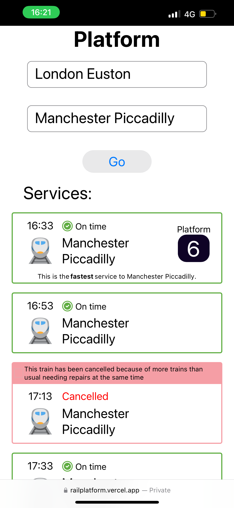

# Platform

Know the platform before it appears in station and get the next fastest train to your destination. Built using SolidJS front-end. This repo contains the frontend source code.

Example: The Platform app (left) shows the platform for the 16:33 service to Manchester Piccadilly before other apps.

<div>

</div>


## Getting Started

1. Run `npm i` to install dependencies.
2. Create a `.env.local` file in the root directory with the following key and values:

```
VITE_API=http://localhost:9090/api
```

The URL must be where the Platform api backend is running. You can find the backend [project here](https://github.com/orchard0/platform-api)

## Development

To start the development server run `npm run dev`.

---

Created by the grace of God.
